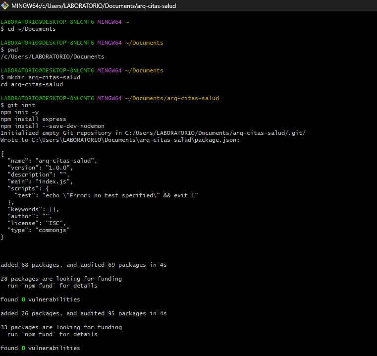
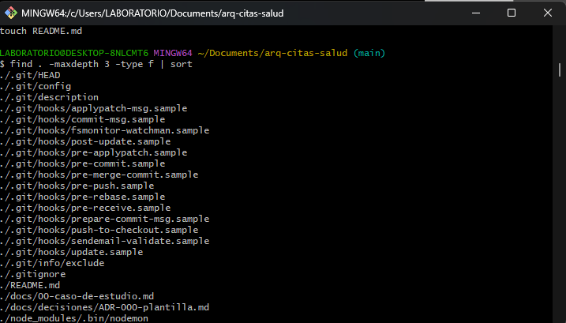

# Arquitectura de Software — IS-488

## Datos del estudiante

**Nombre:** Frank Anthony Cárdenas Bellido
**Curso:** Arquitectura de Software (IS-488)
**Docente:** Ing. Lizbeth Jaico Quispe
**Semestre:** 2026-II

## Descripción del curso

Este curso aborda los fundamentos de la arquitectura de software y las decisiones que permiten organizar y estructurar un sistema, considerando aspectos como seguridad, rendimiento, disponibilidad, escalabilidad y mantenibilidad.

## Expectativas del curso

Espero aprender a diseñar y estructurar sistemas de software de manera organizada y escalable, comprendiendo las decisiones arquitectónicas que se toman durante el desarrollo de un proyecto.

También espero mejorar mis buenas prácticas de desarrollo, trabajo colaborativo con Git y GitHub, y mi capacidad para justificar las decisiones técnicas realizadas durante la construcción de un sistema.

## Evidencias del laboratorio

### Paso 1 — Verificación del entorno

<!-- Inserta aquí la captura de las versiones de Node.js, npm, Git, VS Code y Docker -->

### Paso 2 — Creación de la estructura base

<!-- Inserta aquí la captura de la estructura de carpetas y archivos -->

